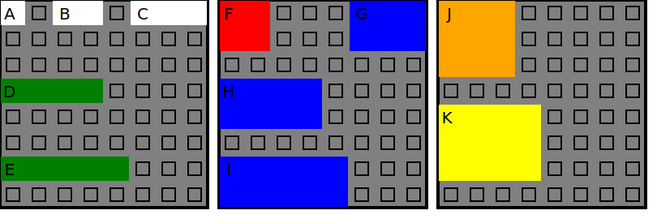
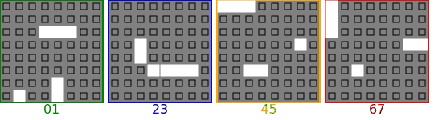
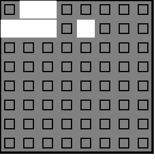

# Rubik's Grid Lock

The game board is a 8x8=64 cell grid. There are 11 pieces of various sizes that
are placed on the board. There are 88 cards showing a starting position with 3 
pieces placed on the board. You must fit all the other pieces onto that starting 
board.

Here are the 11 pieces. I assigned each piece a letter for discussion here and
for modeling in the code:

<!-- SVG pieces
A.BB.CCC EE...FFF JJJ.....
........ EE...FFF JJJ.....
........ ........ JJJ.....
DDDD.... GGGG.... ........
........ GGGG.... ........
........ ........ KKKKK...
EEEEE... HHHHH... KKKKK...
........ HHHHH... KKKKK...
-->

The first 3 pieces -- A, B, and C -- are the "fixed" pieces shown on the 88
cards. Every card shows the position of the three pieces and no other piece.

There are 5 pieces with a height of 1 cell: A, B, C, D, and E. There are 4
pieces with a height of 2 cells: F, G, H, and I. And there are 2 pieces
with a height of 3 cells: J and K.

8 of the pieces have 2 forms: the one shown in the picture above and one that
is rotated 90 degrees. The pieces A, F, and J are square; they have only one 
form as shown.

# Given Solutions

The first board below is what ships with the game. The second solution is printed
on the inside of the case.

# Cards

There are 88 cards. See the complete list here: [all cards](CARDS.md)

There are four levels of 22 cards each from easy to hard. Here is
one card from each difficulty level:

All the cards use pieces A, B, and C. There are more than 88 combinations
of pieces A, B, and C -- more than 88 starting boards. The A piece has
64 possible positions. The B piece has 7*8*2 = 112 positions (remember the
rotations). The C piece has 6*8*2 = 96 positions. If we allow overlaps, we
have 64*112*96 = 688,128 as an upper limit estimate of the nummber of possible
cards. But we don't allow overlaps. 

The code in [gridlock/possible_cards.py](gridlock/possible_cards.py) generates
all legal combinations (no overlaps) of pieces A, B, C. There are 583,864
possible starting points -- possible cards.

Not all these starting configurations are solvable. Take for instance:

<!-- SVG unsolvable
.BB.....
CCC.A...
........
........
........
........
........
........
-->

The 1x1 hole in the upper left can only be filled with the A piece, but the A
piece is already placed on the board elsewhere.

How many solvable cards are there? To answer that, we'll need code to solve
a given board.

# All Solutions

The solver algorithm is simple:
  - Find a piece that is not on the board
  - Try to place that piece at all possible X,Y on the board
  - If the piece fits:
    - If there are no blank spaces on the board, note the solution and keep going
    - Call the solver algorithm recursively for the new board

The python implementation of this algorithm takes 2.5 hours on my computer.

The golang implementation takes just over 1 minute to try all possible combinations of 
pieces. The program appends each solution to a binary file for later processing. Each 
solution is 64 bytes (one byte per square on the grid).

The code found 1,977,968 possible solutions. The solutions binary file is 64 times that
or roughly 126M.

# Rotations and Mirroring

When you find a solution, you can rotate the board four times to get a total of four
solutions that are technically unique. You can also take a mirror image of the board
and make four more rotations. Every solution is thus a family of 8 solutions when you
apply rotations and mirroring.

The solver finds all possible solutions without filtering out rotated/mirrored solutions.
We expect the total number of found solutions to be a multiple of 8, which it is. The number of
solution "families" is 1,977,968 / 8 = 247,246. If you memorize these 250K solutions, you can
quickly generate all 2 million possible solutions with a mirror and rotations. That should
impress your friends!

# All Possible Cards

All the cards are rotationally unique as checked by [gridlock/cards_checker.py](gridlock/cards_checker.py).

TODO: Count the solutions for each card. Does this indicate the difficulty?

TODO: knock off with rotated cards

What makes one card "harder" than another? Is it the number of solutions?

How many possible cards are there? How many of those possible are solvable?

Ignoring rotations:
- How many possible cards are there?
- How many winning/losing cards are there?
- Are Jacob's cards the same as mine?
