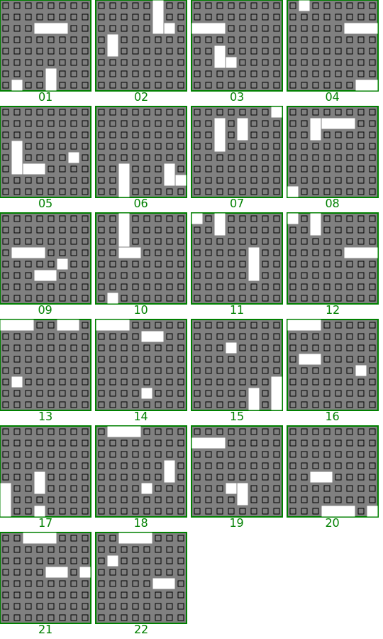
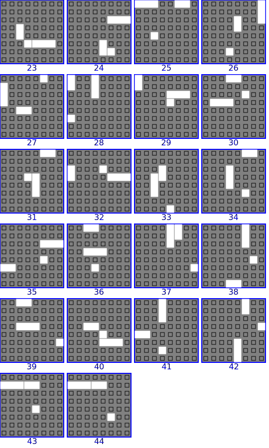

# sim-gridLock
Rubik's Grid Lock

# Given Solutions

The first board is what ships with the game. The second solution is printed
on the inside of the case.

# Cards

Level 1 (green 01-22):

Level 2 (blue 23-44):

