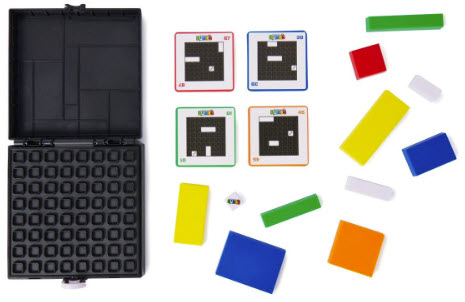
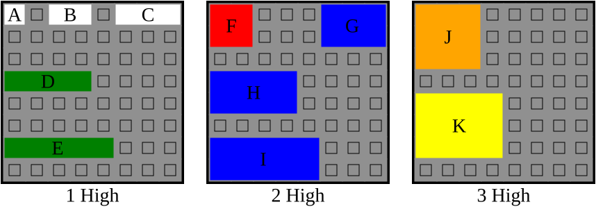
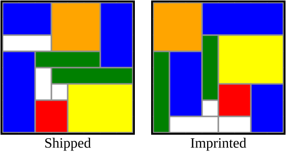
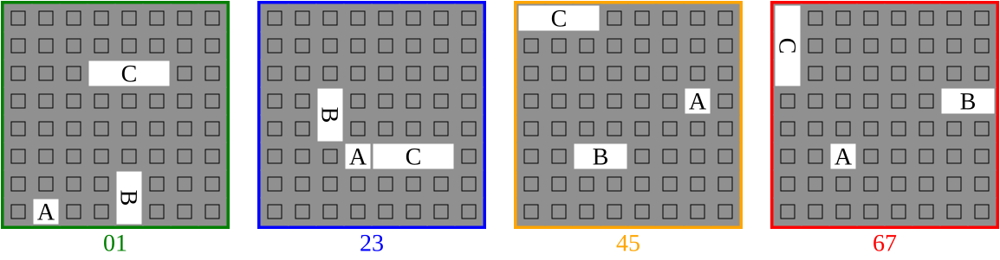
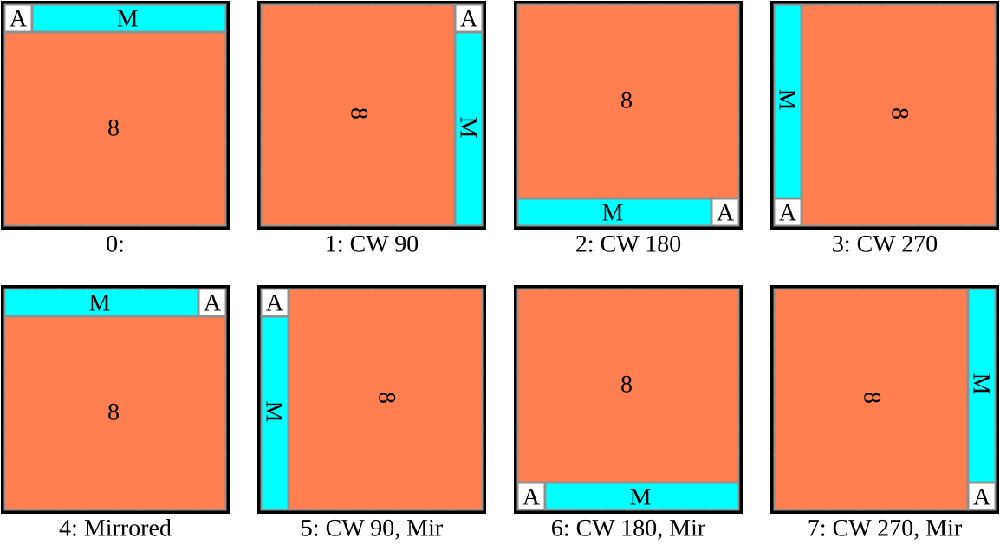
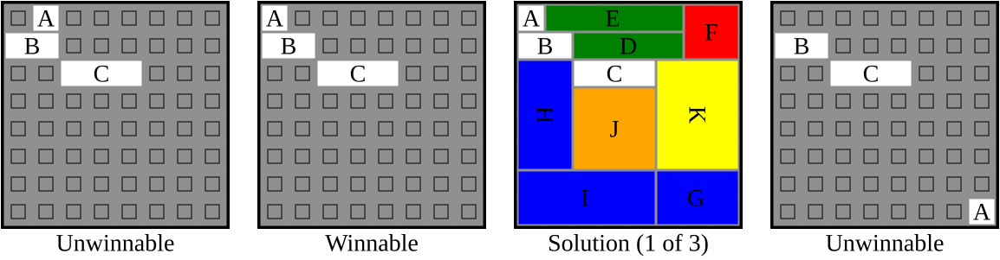
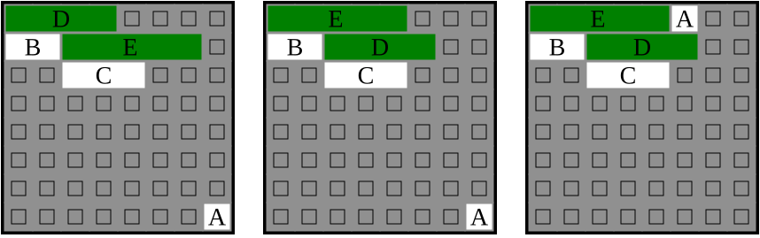
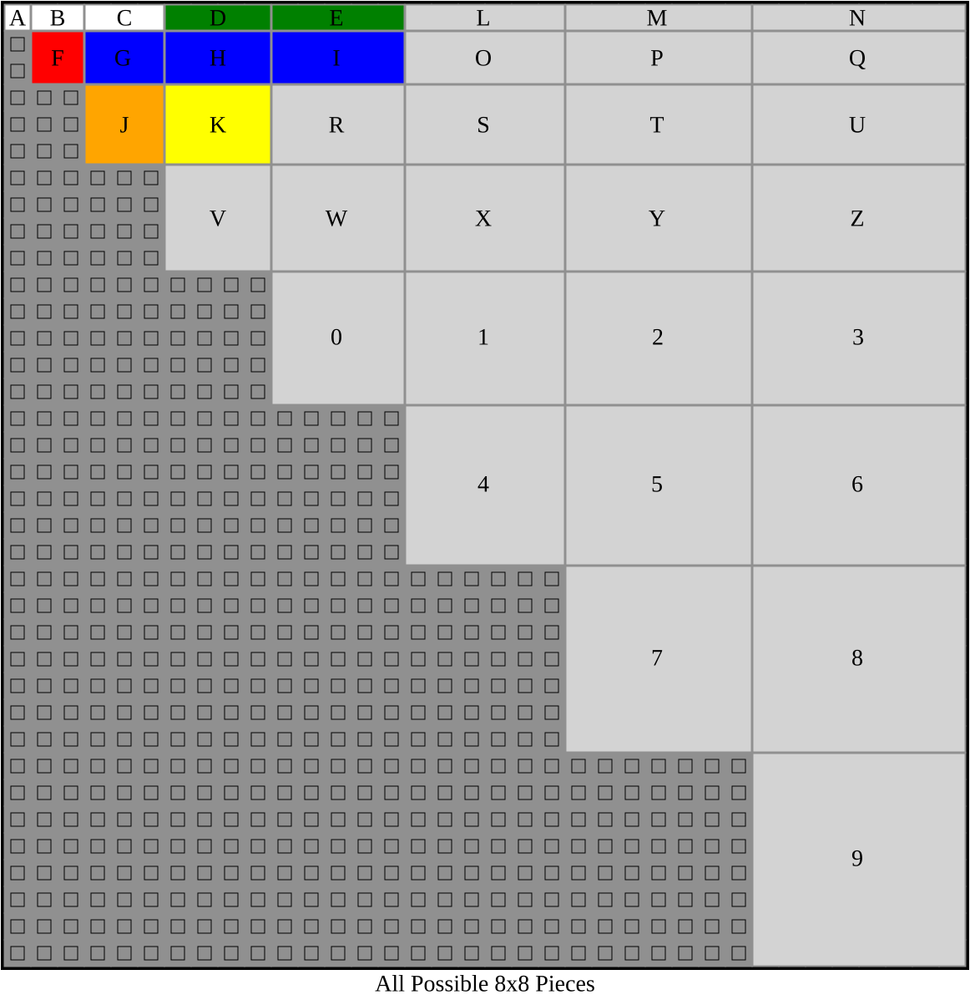

# At a Glance

Here are some quick facts about the "Rubik's Grid Lock" universe. A detailed discussion follows.

Here are the [solutions to all 88 cards.](SOLUTIONS.md)

There are 1,977,968 [(discussion)](#total-solutions) ways to fit every piece on the board.

There are 583,864 [(discussion)](#total-abc) ways to fit pieces A, B, and C on the board to start a challenge. These starting boards 
come in rotational families of 8 [(discussion)](#rotations). Thus there are 583,864 / 8 = 72,983 rotationally-unique 
starting points. Of these, only 13,967 starting positions are winnable.

Out of 13,967 possible start-position cards, the game only includes 88. All of the given cards have exactly 1 solution. There are 1,850 cards that have exactly 1 solution. Most start positions have multiple solutions. (Two of the starts have 1,084 solutions.)

The given cards are divided into four levels of challenges (22 cards in each level). I have yet to determine what makes one card harder than any other.

The game ships with 11 pieces, but there are 36 [possible unique pieces](art/possible-pieces.svg) for an 8x8 board.

These 36 pieces can be grouped into 28,725 sets of pieces whose areas total 64 (the 8x8 board's area). But only 17,385 of these sets have solutions. Many sets like 
ACEFJLVW have just 8 solutions. Set ABCDEFGHILMN has the most pieces (12) and the most solutions (5,324,896).

There are lots of sets with 11 pieces. The given set ABCDEFGHIJK has the 2nd most solutions: 1,977,968.

There are other possible board dimensions. For instance, a 5x3 board has 18 winnable sets of pieces. The set 5x3:ABCDE has the most solutions of any set, with 40. Set 5x3:GFCB is in second place with 32.

# Rubik's Grid Lock



The game board is an 8x8=64 cell grid. There are 11 unique pieces of various sizes that are placed on the board. There are 88 challenge cards. Each card shows the starting board with  A, B, and C placed on the board. You must fit all the other pieces onto that starting board.

Here are the 11 pieces. I assigned each piece a letter for discussion here and for modeling in the code:

<!-- SVG pieces
A.BB.CCC EE...FFF JJJ.....
........ EE...FFF JJJ.....
........ ........ JJJ.....
DDDD.... GGGG.... ........
........ GGGG.... ........
........ ........ KKKKK...
EEEEE... HHHHH... KKKKK...
........ HHHHH... KKKKK...
-->


The first 3 pieces -- A, B, and C -- are the fixed pieces shown on the 88 cards. Every card shows the position of these three pieces and no other piece.

There are 5 pieces with a height of 1 cell: A, B, C, D, and E. There are 4 pieces that are 2 cells high: F, G, H, and I. And there are 2 pieces, J and K, that are 3 cells high.

8 of the pieces have 2 forms: the one shown in the picture above and another rotated 90 degrees. The pieces A, F, and J are square; they have only one form as shown.

# Given Solutions

When you unwrap the game for the first time, the pieces are arranged on the board
in the first solution first solution below. The second solution is imprinted on 
the inside of the case.



# Challenge Cards

There are 88 cards. See the complete list here: [all cards](CARDS.md)

There are four levels of 22 cards each, from easy to hard. Here is one card from each difficulty level:



All the cards use pieces A, B, and C. Are these 88 cards all of the possible cards? If not, how many possible cards are there?

The code in [gridlock/report_cards.report_all_possible_cards] generates all legal combinations (no overlaps) of pieces A, B, and C. There are 583,864 possible starting points. To figure out how many of these are solvable, we'll need code to solve a board.

# All Solutions

The solver algorithm is simple:
  - Find a piece that is not on the board
  - Try to place that piece at all possible X,Y on the board
  - If the piece fits at X,Y:
    - If there are no blank spaces remaining on the board, note the solution
    - Else, call the solver algorithm recursively for the new board
  - If the piece fits or doesn't fit: keep going with this piece for all possible X,Y
  - Repeat for all pieces not on the board

I wrote the solver in Go for performance: [cmd/solver/main.go]. The program takes an input text file that gives the starting board and a list of possible pieces.

<a id="total-solutions"></a>I ran the program with a blank starting board and the 11 given pieces to find all possible solutions. It took just under a minute to find all 1,977,968 possible solutions to the game. The program writes the solutions to a binary file `solutions.bin` for later processing. This 126M binary file is NOT checked into the repo.

# <a id="rotations">Rotations and Mirroring

Starting with a blank board, there are 1,977,968 possible solutions. These blank-board solutions come in families of 8. When you find a solution, you can rotate
the board 90, 180, and 270 degrees for 3 more solutions. Then you can mirror the solution left-to-right for another solution. Then rotate that mirrored
solution 90, 180, and 270 degrees for a total of 8 solutions that are tightly related. For example:



The number 1,977,986 is indeed a multiple of 8. I wrote code to sanity-check the 1,977,968 solutions. The code rotated and mirrored each solution
and compared it to the rest of the solutions. As expected, the solutions fit perfectly into unique families of 8.

When you play the game, you start with a game card that has a single orientation.

# <a id="total-abc">All Possible Cards

I used the solver with a blank board and pieces A, B, and C to generate "abc_positions.bin" containing all legal starting points. The binary file is
37,367,296 bytes. Divided by 64, that's 583,864 starting boards. These come in rotation families of 8. If we keep just one starting point from each 
family we get 583,864/8 = 72,983 rotationally unique starting points. (The 88 given cards are rotationally unique.)


TODO need work from here
The [report_cards.report_all_possible_cards] function loads the "abc_positions.bin" and removes rotational duplicates. The function also loads
"solutions.bin" (all solutions) and extracts the starting point from each solution by removing all pieces except A, B, and C from the board.

The function compares "abc_positions.bin" and "solutions.bin" to sort the possible starting positions into "winnable" and "nonwinnable". The "winnable.json"
file contains all possible winning starting positions and and example solution for it. If the starting position is a given card, the card name is added
to the record.

The "nonwinnable.json" file contains a list of starting positions that are not winnable.

The code found 32,528 winnable starting positions that are rotationally unique. That means there are 32,528 possible starting cards, but
the game only gives 88 of these.

Many of the unwinnable starting points are obviously not winnable. For example, the first starting position here:



There is a 1x2 hole in the upper left that can only be filled with piece A. But piece A is already fixed to the board. There is no way to fill
that hole, and the starting point is unwinnable.

If you move A to the left one spot as in the second board, the challenge is winnable with three different solutions. One solution is the 
3rd board.

The last board above is not so obviously winnable until you take a closer look. That top row above the B piece can only be filled with a
piece of height 1 -- A, B, C, D, or E. But A, B, and C are already fixed to the board. Only D or E can go there:



Once D or E are placed, the second row above C requires a height-1 piece -- so the other D/E piece goes there. Now there is a height-1 gap
at the top of the board, but we are out of height-1 pieces. The board is unsolvable. If the A piece is in the upper left or to the
right of the E piece on the top row, the gap in the upper-right can be filled with a 2-width piece, as shown in the solution.

TODO numbers from the report on most/least winnable. gridlock.report_winnable

Solution counts per winnable position:
1: 1850 (1850 starting positions have exactly 1 solution. Every card is in this set.)
2: 2326
3: 933
4: 1213
...
647: 1
740: 5
787: 2
832: 4
983: 4
1084: 2 (two starting positions have 1084 solutions)

['CCC............................................B.......B.......A', 1084, 'CCCKKKKEJJJKKKKEJJJKKKKEJJJDDDDEIIIIIFFEIIIIIFFBHHHHGGGBHHHHGGGA']
['CCC............................................A.......B.......B', 1084, 'CCCKKKKEJJJKKKKEJJJKKKKEJJJDDDDEIIIIIFFEIIIIIFFAHHHHGGGBHHHHGGGB']

TODO: Number of solutions for each card. Does this indicate the difficulty? What makes one card "harder" 
than another?


# All Possible Pieces



A set of pieces must:
  - equal the area of the board (64)
  - have at least one solution

TODO there are 28,725 sets of pieces that total 64

TODO count the solutions for each piece set

```
   PIECES        NUM-SOL   EXAMPLE-SOL

----- Sorted by number of pieces in set:
('NMLIHGFEDCBA', 5324896, 'NNNNNNNNMMMMMMMDLLLLLLADIIIIIFFDIIIIIFFDHHHHGGGBHHHHGGGBEEEEECCC')
('KJIHGFEDCBA',  1977968, 'KKKKJJJCKKKKJJJCKKKKJJJCIIIIIGGGIIIIIGGGHHHHDDDDHHHHAFFBEEEEEFFB')
('LKJIHFEDCBA',   368416, 'LLLLLLAEKKKKJJJEKKKKJJJEKKKKJJJEIIIIIFFEIIIIIFFBHHHHCCCBHHHHDDDD')
('NKJIGFEDCBA',   905856, 'NNNNNNNNKKKKJJJCKKKKJJJCKKKKJJJCIIIIIGGGIIIIIGGGFFEEEEEAFFDDDDBB')
('MLKJIGFDCBA',   258792, 'MMMMMMMALLLLLLFFKKKKBBFFKKKKJJJCKKKKJJJCDDDDJJJCIIIIIGGGIIIIIGGG')
('NLKJIFEDCBA',   425792, 'NNNNNNNNLLLLLLADKKKKJJJDKKKKJJJDKKKKJJJDIIIIIFFBIIIIIFFBEEEEECCC')
('MLKJHGFEDBA',   324032, 'MMMMMMMELLLLLLAEKKKKJJJEKKKKJJJEKKKKJJJEHHHHGGFFHHHHGGFFDDDDGGBB')
('NLKJHGFECBA',   434544, 'NNNNNNNNLLLLLLBBKKKKJJJCKKKKJJJCKKKKJJJCHHHHFFGGHHHHFFGGEEEEEAGG')
('NMKJHGFDCBA',   568752, 'NNNNNNNNMMMMMMMCKKKKJJJCKKKKJJJCKKKKJJJAHHHHGGFFHHHHGGFFDDDDGGBB')
('NLKJHGEDCBA',  1161632, 'NNNNNNNNLLLLLLADKKKKJJJDKKKKJJJDKKKKJJJDHHHHGGGBHHHHGGGBEEEEECCC')
...
('4QO',  8, '444444OO444444OO444444OO444444OO444444OO444444OOQQQQQQQQQQQQQQQQ')
('3QN', 12, '3333333333333333333333333333333333333333QQQQQQQQQQQQQQQQNNNNNNNN')
('2TN',  8, '2222222N2222222N2222222N2222222N2222222NTTTTTTTNTTTTTTTNTTTTTTTN')
('1SQ',  8, '111111QQ111111QQ111111QQ111111QQ111111QQSSSSSSQQSSSSSSQQSSSSSSQQ')
('0UR',  8, '00000RRR00000RRR00000RRR00000RRR00000RRRUUUUUUUUUUUUUUUUUUUUUUUU')
('ZUN', 12, 'ZZZZZZZZZZZZZZZZZZZZZZZZZZZZZZZZUUUUUUUUUUUUUUUUUUUUUUUUNNNNNNNN')
('8N',   4, '88888888888888888888888888888888888888888888888888888888NNNNNNNN')
('6Q',   4, '666666666666666666666666666666666666666666666666QQQQQQQQQQQQQQQQ')
('3U',   4, '3333333333333333333333333333333333333333UUUUUUUUUUUUUUUUUUUUUUUU')
('9',    1, '9999999999999999999999999999999999999999999999999999999999999999')

----- Sorted by number of solutions:
('NMLIHGFEDCBA', 5324896, 'NNNNNNNNMMMMMMMDLLLLLLADIIIIIFFDIIIIIFFDHHHHGGGBHHHHGGGBEEEEECCC')
('KJIHGFEDCBA',  1977968, 'KKKKJJJCKKKKJJJCKKKKJJJCIIIIIGGGIIIIIGGGHHHHDDDDHHHHAFFBEEEEEFFB')
('RLIHGFEDCBA',  1227224, 'RRRRRGGGRRRRRGGGRRRRRBBELLLLLLAEIIIIIFFEIIIIIFFEHHHHCCCEHHHHDDDD')
('PMIHGFEDCBA',  1220328, 'PPPPPPPCPPPPPPPCMMMMMMMCIIIIIGGGIIIIIGGGHHHHDDDDHHHHAFFBEEEEEFFB')
('NLKJHGEDCBA',  1161632, 'NNNNNNNNLLLLLLADKKKKJJJDKKKKJJJDKKKKJJJDHHHHGGGBHHHHGGGBEEEEECCC')
('MLKIHGEDCBA',  1106448, 'MMMMMMMALLLLLLBBKKKKHHHHKKKKHHHHKKKKDDDDIIIIIGGGIIIIIGGGEEEEECCC')
('NKJIGFEDCBA',   905856, 'NNNNNNNNKKKKJJJCKKKKJJJCKKKKJJJCIIIIIGGGIIIIIGGGFFEEEEEAFFDDDDBB')
('OJIHGFEDCBA',   878680, 'OOOOOOFFOOOOOOFFJJJIIIIIJJJIIIIIJJJHHHHBGGGHHHHBGGGEEEEEDDDDCCCA')
('RNLIGFEDCBA',   876880, 'RRRRRGGGRRRRRGGGRRRRRCCCNNNNNNNNLLLLLLADIIIIIFFDIIIIIFFDEEEEEBBD')
('NMKIHFEDCBA',   833920, 'NNNNNNNNMMMMMMMAKKKKHHHHKKKKHHHHKKKKDDDDIIIIIFFBIIIIIFFBEEEEECCC')
...
('5QL', 8, '5555555L5555555L5555555L5555555L5555555L5555555LQQQQQQQQQQQQQQQQ')
('5PN', 8, '5555555N5555555N5555555N5555555N5555555N5555555NPPPPPPPNPPPPPPPN')
('4QO', 8, '444444OO444444OO444444OO444444OO444444OO444444OOQQQQQQQQQQQQQQQQ')
('2TN', 8, '2222222N2222222N2222222N2222222N2222222NTTTTTTTNTTTTTTTNTTTTTTTN')
('1SQ', 8, '111111QQ111111QQ111111QQ111111QQ111111QQSSSSSSQQSSSSSSQQSSSSSSQQ')
('0UR', 8, '00000RRR00000RRR00000RRR00000RRR00000RRRUUUUUUUUUUUUUUUUUUUUUUUU')
('8N',  4, '88888888888888888888888888888888888888888888888888888888NNNNNNNN')
('6Q',  4, '666666666666666666666666666666666666666666666666QQQQQQQQQQQQQQQQ')
('3U',  4, '3333333333333333333333333333333333333333UUUUUUUUUUUUUUUUUUUUUUUU')
('9',   1, '9999999999999999999999999999999999999999999999999999999999999999')
```

# TODO different size boards

The set-solver program takes the dimensions of the board and allowed pieces as arguments.

a 5x3 board has 18 winnable sets of pieces. The set ABCDE has the most solutions of any set, with 40. Set GFCB is in second place with 32.

2x2 board -- just the one soltuion wiht the 2x2 piece (F)
```
1 F 1 FFFF (0:00:00.039509)
2 D 0 .... (0:00:00.037297)
3 CA 0 .... (0:00:00.038661)
```

2x3 board -- the 3x2 piece and BF and ABC.
```
1 G 1 GGGGGG (0:00:00.042629)
2 FB 2 FFFFBB (0:00:00.037371)
3 EA 0 ...... (0:00:00.038629)
4 DB 0 ...... (0:00:00.037272)
5 CBA 4 CBCBCA (0:00:00.042582)
6 L 0 ...... (0:00:00.040507)
```

5x3
```
1 KC 2 KKKKCKKKKCKKKKC (0:00:00.038937)
2 KBA 4 KKKKBKKKKBKKKKA (0:00:00.037868)
3 JG 2 JJJGGJJJGGJJJGG (0:00:00.036047)
4 JFB 4 JJJFFJJJFFJJJBB (0:00:00.037121)
7 JCBA 12 JJJCBJJJCBJJJCA (0:00:00.036577)
10 IE 2 IIIIIIIIIIEEEEE (0:00:00.036933)
11 IDA 4 IIIIIIIIIIDDDDA (0:00:00.035167)
12 ICB 4 IIIIIIIIIICCCBB (0:00:00.036809)
16 HEB 4 HHHHBHHHHBEEEEE (0:00:00.035206)
17 HDC 4 HHHHCHHHHCDDDDC (0:00:00.036859)
18 HDBA 12 HHHHBHHHHBDDDDA (0:00:00.035978)
21 GFE 4 GGGFFGGGFFEEEEE (0:00:00.037672)
22 GFDA 8 GGGFFGGGFFDDDDA (0:00:00.036039)
23 GFCB 32 GGGFFGGGFFCCCBB (0:00:00.035741)
26 GDCB 8 GGGBCGGGBCDDDDC (0:00:00.037125)
32 FECBA 16 FFCCCFFBBAEEEEE (0:00:00.036426)
40 EDCBA 40 EEEEEDDDDACCCBB (0:00:00.035441)
55 R 1 RRRRRRRRRRRRRRR (0:00:00.035721)
```

max possible in my one-byte-cell model is 1+2+3+...+21+22 = 253 pieces -- 22x22.

PS D:\git\sim-gridLock> py -m gridlock.possible_pieces 9 8
>>> Total sets of pieces: 56007
>>> Starting with NKJIHGFEDCBA

>>> Total sets of pieces: 111631
>>> Starting with SKJIHGFEDCB
1 SKJIHGFEDCB 1918432 SSSSSSJJJSSSSSSJJJSSSSSSJJJKKKKIIIIIKKKKIIIIIKKKKHHHHDCGGGHHHHDCGGGBBFFDCEEEEEFFD (0:02:28.531028)
2 OLKJIHGFEDCB 11652816 OOOOOOJJJOOOOOOJJJLLLLLLJJJKKKKIIIIIKKKKIIIIIKKKKHHHHDCGGGHHHHDCGGGBBFFDCEEEEEFFD (0:30:19.892146)
3 OMKJIHGFEDCA 2118576 OOOOOOCCCOOOOOOAGGMMMMMMMGGKKKKJJJGGKKKKJJJFFKKKKJJJFFIIIIIHHHHIIIIIHHHHEEEEEDDDD (0:10:51.237025)
4 WKJIHGFEDC 179576 WWWWWKKKKWWWWWKKKKWWWWWKKKKWWWWWJJJCIIIIIJJJCIIIIIJJJCHHHHGGGFFHHHHGGGFFEEEEEDDDD (0:00:36.842549)
5 PLKJIHGFEDC 551824 PPPPPPPFFPPPPPPPFFLLLLLLJJJKKKKGGJJJKKKKGGJJJKKKKGGCCCIIIIIHHHHIIIIIHHHHEEEEEDDDD (0:05:36.348722)
6 ONKJIHGFEDC 225192 OOOOOOFFCOOOOOOFFCNNNNNNNNCKKKKJJJGGKKKKJJJGGKKKKJJJGGIIIIIHHHHIIIIIHHHHEEEEEDDDD (0:04:00.839311)
7 WKJIHGFEDBA 898768 WWWWWKKKKWWWWWKKKKWWWWWKKKKWWWWWJJJBIIIIIJJJBIIIIIJJJAHHHHGGGFFHHHHGGGFFEEEEEDDDD (0:00:39.855683)
8 PLKJIHGFEDBA 3135920 PPPPPPPFFPPPPPPPFFLLLLLLJJJKKKKGGJJJKKKKGGJJJKKKKGGBBAIIIIIHHHHIIIIIHHHHEEEEEDDDD (0:05:42.587921)
9 ONKJIHGFEDBA 2487264 OOOOOOGGGOOOOOOGGGNNNNNNNNAKKKKJJJFFKKKKJJJFFKKKKJJJBBIIIIIHHHHIIIIIHHHHEEEEEDDDD (0:04:02.526718)
10 TKJIHGFEDB 99408 TTTTTTTGGTTTTTTTGGTTTTTTTGGKKKKJJJFFKKKKJJJFFKKKKJJJBBIIIIIHHHHIIIIIHHHHEEEEEDDDD (0:00:14.282167)
11 RLKJIHGFEDB 1022360 RRRRRKKKKRRRRRKKKKRRRRRKKKKLLLLLLJJJIIIIIBJJJIIIIIBJJJHHHHGGGFFHHHHGGGFFEEEEEDDDD (0:04:55.496474)
12 PMKJIHGFEDB 632240 PPPPPPPGGPPPPPPPGGMMMMMMMGGKKKKJJJFFKKKKJJJFFKKKKJJJBBIIIIIHHHHIIIIIHHHHEEEEEDDDD (0:02:33.378177)

PS D:\git\sim-gridLock> py -m gridlock.possible_pieces 12 12
>>> Total sets of pieces: 4040510

>>> TSRPOKJIHGFEDCBA

TTTTTTTRRRRR
TTTTTTTRRRRR
TTTTTTTRRRRR
SSSSSSOOOOOO
SSSSSSOOOOOO
SSSSSSAKKKKC
PPPPPPPKKKKC
PPPPPPPKKKKC
JJJIIIIIHHHH
JJJIIIIIHHHH
JJJDDDDGGGFF
EEEEEBBGGGFF